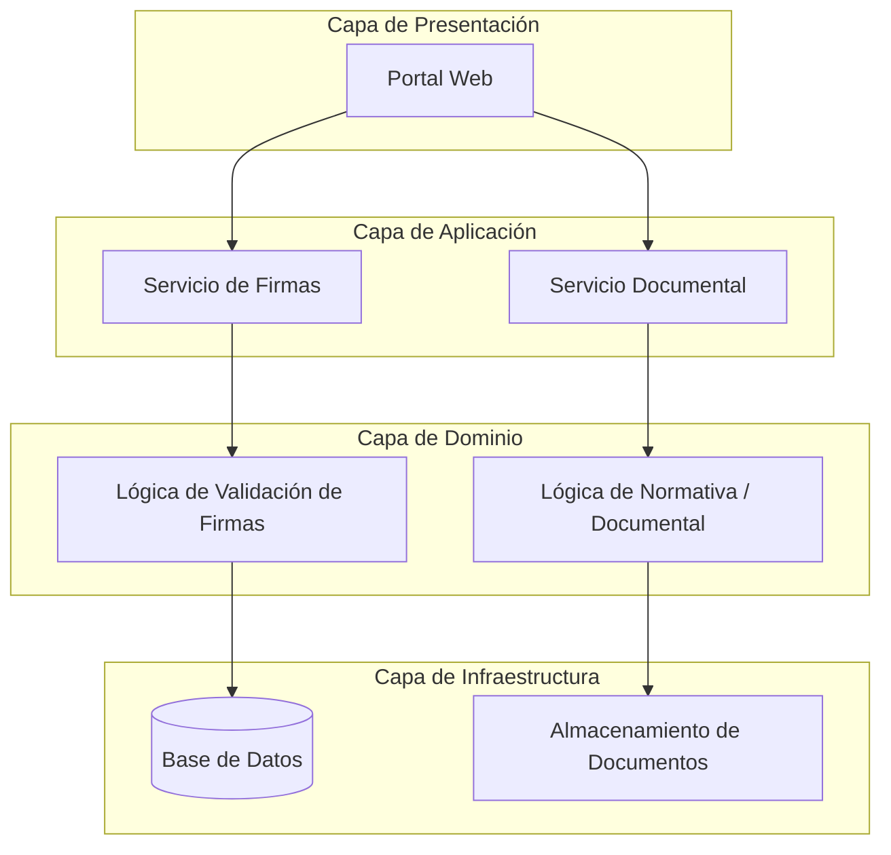

# Práctica calificada 3 - Desarrollo de Software

- Nombre y apellidos: Ángel Aarón Flores Alberca
- Código: 20221346A

El documento de pruebas se encuentra en [tests.md](tests.md)

## Descripción

El **Legislativo de la República** requiere el desarrollo de una plataforma digital "Voz del Ciudadano" para automatizar el procesamiento de Iniciativas Legislativas de los Ciudadanos.

---

## Requerimientos del Sistema

+ El software debe permitir a los colectivos civiles crear propuestas normativas y recolectar firmas de apoyo de la sociedad civil.
+ Cuando se alcanza un límite constitucional de 25,000 firmas digitales validadas en un plazo máximo de 90 días, el sistema congela criptográficamente el archivo y lo envía a la Oficina del Congreso para su distribución a las comisiones parlamentarias.
+ El ciudadano debe ser capaz de poder subir comentarios, firmas, modificaciones y recursos que soporten la propuesta.
+ El sistema debe permitir a los ciudadanos registrarse e iniciar sesión en la plataforma para acceder a las funcionalidades de firma y creación de propuestas.
+ El sistema debe permitir a cualquier visitante consultar el listado de iniciativas activas y el progreso de firmas de cada una, sin necesidad de autenticarse.

---

## Arquitectura de Software

La plataforma sigue una **arquitectura en capas** que separa responsabilidades y facilita el reemplazo de componentes de forma independiente.

---

## Historias de Usuario

### HU-01: Registro de Firma Digital

> **Como** ciudadano, **necesito** registrar mi firma digital en una iniciativa legislativa activa, **para que** mi apoyo sea contabilizado de forma válida y segura.

**Actor principal:** Ciudadano

**Flujo principal:**

1. El ciudadano ingresa su DNI en el portal y selecciona la iniciativa que desea firmar.
2. El Portal Web delega la solicitud al **Servicio de Firmas**, que invoca la `FachadaVerificacionIdentidad` en la capa de dominio para coordinar las validaciones internas (formato del DNI y estado en el padrón).
3. El `ProxyRepositorioFirmas` consulta la **Base de Datos** para verificar que el ciudadano no haya firmado previamente; si es válido, delega la escritura al repositorio real.
4. La firma se persiste en la **Base de Datos** y el contador de la iniciativa se actualiza; al alcanzar 25,000 firmas se dispara el proceso de sellado criptográfico.

**Patrones estructurales aplicados:**

| Patrón | Componente | Rol en el caso de uso |
|---|---|---|
| **Facade** | `FachadaVerificacionIdentidad` | Expone el método `validarCiudadano(dni)` ocultando la complejidad de los subsistemas internos de validación (formato del DNI, unicidad y estado del ciudadano) desde un único punto de entrada. |
| **Proxy** | `ProxyRepositorioFirmas` | Verifica duplicados y registra auditoría antes de permitir la escritura. |
| **Decorator** | `DecoradorValidacionFirma` | Permite añadir capas de verificación adicionales sobre la firma de forma dinámica, sin modificar la clase base. |

---

### HU-02: Construcción de la Propuesta Normativa

> **Como** colectivo civil,
**necesito** construir mi propuesta normativa y adjuntarle documentos de soporte,
**para que** pueda ser presentada de forma estructurada ante el Congreso.

**Actor principal:** Colectivo civil

**Flujo principal:**

1. El colectivo accede al portal y crea una nueva propuesta, incorporando secciones, artículos y anexos de forma incremental.
2. El Portal Web delega al **Servicio Documental**, que gestiona la estructura en la capa de **Lógica Normativa/Documental**: `Propuesta`, `Seccion` y `Articulo` implementan la interfaz común `ComponenteDocumental`, permitiendo operar sobre todo el árbol con una sola llamada.
3. Si el colectivo adjunta archivos externos (PDF o DOCX), los adaptadores los traducen a `IDocumentoNormativo` antes de que lleguen a la capa de dominio.
4. Al alcanzar las 25,000 firmas, la capa de dominio sella criptográficamente el árbol y el **Servicio Documental** recupera el documento del **Almacenamiento** y lo envía a la Oficina del Congreso.

**Patrones estructurales aplicados:**

| Patrón | Componente | Rol en el caso de uso |
|---|---|---|
| **Composite** | `ComponenteDocumental` / `Propuesta` / `Seccion` / `Articulo` | Modela la propuesta como un árbol; permite tratar hojas y nodos compuestos de forma uniforme (exportar, sellar, calcular tamaño total). |
| **Adapter** | `AdaptadorPDF`, `AdaptadorDOCX` | Convierte documentos externos en distintos formatos a la interfaz `IDocumentoNormativo` que consume el dominio, desacoplándolo de cada formato. |
